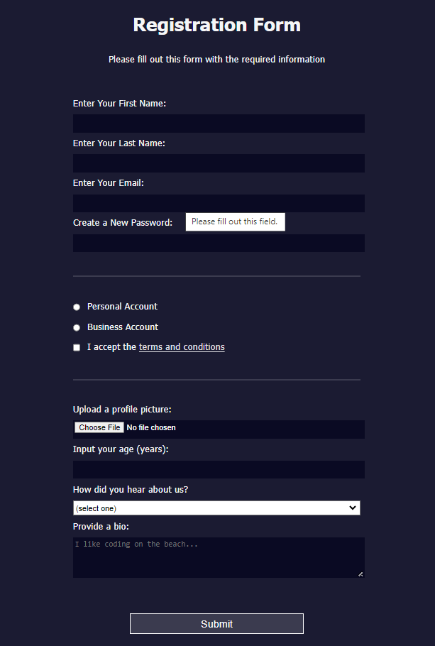

# Registration_Form

## This is a pure HTML and CSS Registration form to collect information from people who visit your web page.

A signup page to control what types of data people can type into a form and CSS tools for styling the page.

## Below you see a model of form:

